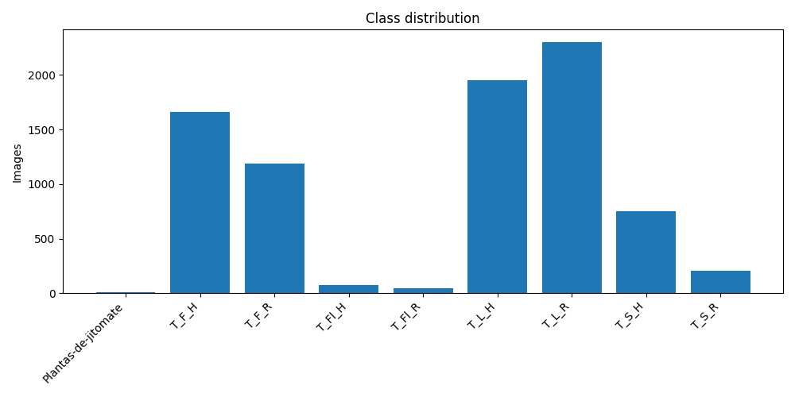
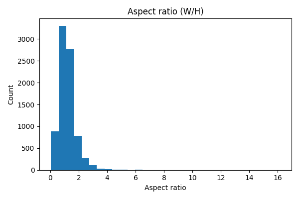

# Tomate Rugoso

## Overview

> **Objective:** TODO: Describe the goal of this dataset. Why it was collected? What problem does it solve?

> **Domain:** TODO: Agriculture / Medical / Industrial / etc.

> **Source:** TODO: Add collection method, instruments, or references.


## Summary

- **Task:** Classification

- **Images:** 8,181

- **Classes:** 9

- **URL:** Rugose


## Dataset Structure

```

root/

  class1/
  class2/

```

Each class folder contains raw image files.


## Classes

- **Plantas-de-jitomate** (7 images) — TODO: Describe Plantas-de-jitomate
- **T_F_H** (1659 images) — TODO: Describe T_F_H
- **T_F_R** (1186 images) — TODO: Describe T_F_R
- **T_Fl_H** (77 images) — TODO: Describe T_Fl_H
- **T_Fl_R** (43 images) — TODO: Describe T_Fl_R
- **T_L_H** (1953 images) — TODO: Describe T_L_H
- **T_L_R** (2301 images) — TODO: Describe T_L_R
- **T_S_H** (750 images) — TODO: Describe T_S_H
- **T_S_R** (205 images) — TODO: Describe T_S_R

## Statistics

- Estimated duplicate images: **11**
- Color summary: {'color': 8181}
- Top resolutions: [['44x28', 8], ['38x30', 8], ['40x32', 7], ['41x36', 7], ['30x26', 7], ['27x24', 7], ['29x28', 7], ['27x21', 7], ['22x21', 7], ['29x25', 7]]
- Width [min/mean/median/max]: 4.0/142.2/88.0/2246.0
- Height [min/mean/median/max]: 3.0/139.9/80.0/2883.0
- Aspect ratio [min/mean/median/max]: 0.050/1.203/1.112/16.162

## Class Distribution



## Aspect Ratio Histogram



## Example Images

**Plantas-de-jitomate**

     

**T_F_H**

     

**T_F_R**

     

**T_Fl_H**

     

**T_Fl_R**

     

**T_L_H**

     

**T_L_R**

     

**T_S_H**

     

**T_S_R**

     

## Usage

```python

# TODO: Add code snippet to load and use dataset (PyTorch / TensorFlow / etc.)

```

## Citation

If you use this dataset, please cite:

```
TODO: BibTeX or reference
```

## License

TODO: Add license information (MIT, CC-BY, proprietary, etc.)
